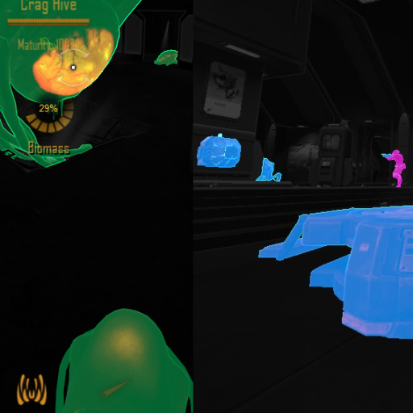
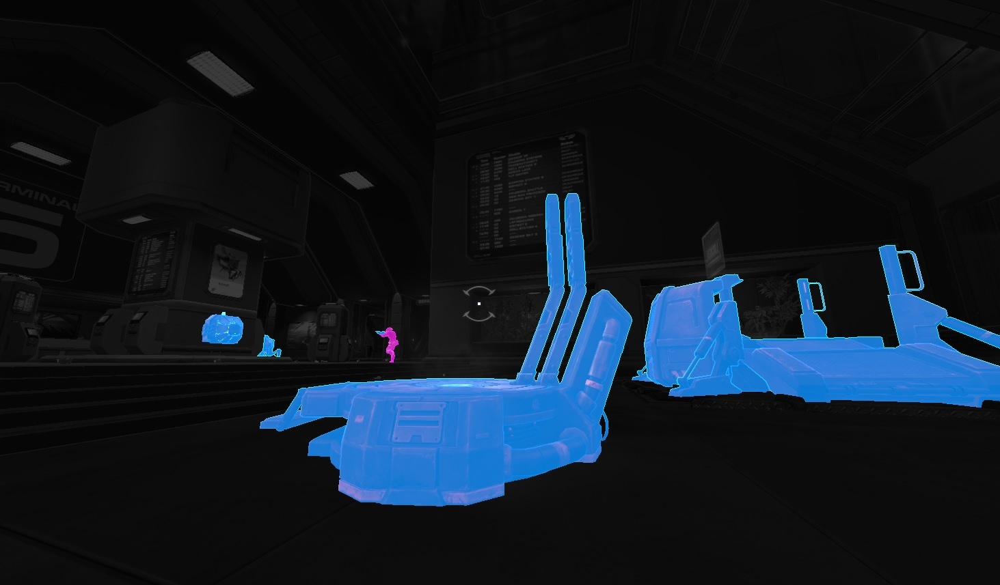
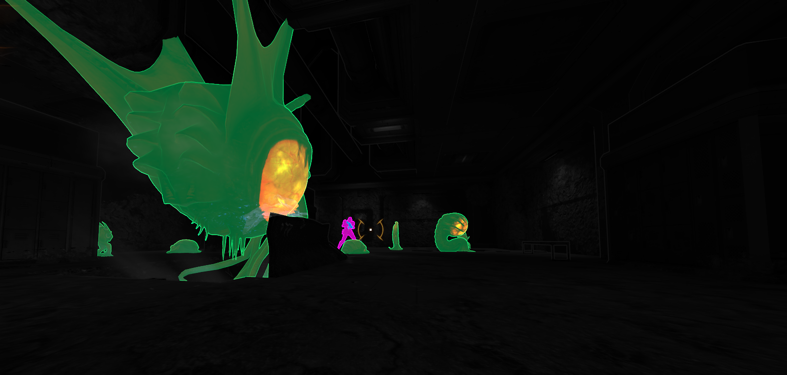

## phrogg eyes dark
phroggie's Alien Vision (***Dark***) mod for [Natural Selection 2](https://steamcommunity.com/app/4920 "Steam NS2 Store"), the classic multiplayer first-person shooter meets real-time strategy meets quick hungry aliens game.

### Description
Mostly dark grayscales with some obvious coloring. Ideal for night-time use.
Download by subscribing to the mod in the [Steam Workshop](https://steamcommunity.com/sharedfiles/filedetails/?id=2822011098) (mod ID `2822011098`), then activate it in-game to see the world just like a phrogg does.

### Source
The majority of this folder contains packaging metadata and supporting files. If you just want to "steal" my source, check out the [output/shaders/DarkVision.hlsl](output/shaders/DarkVision.hlsl) file.

### Previews

